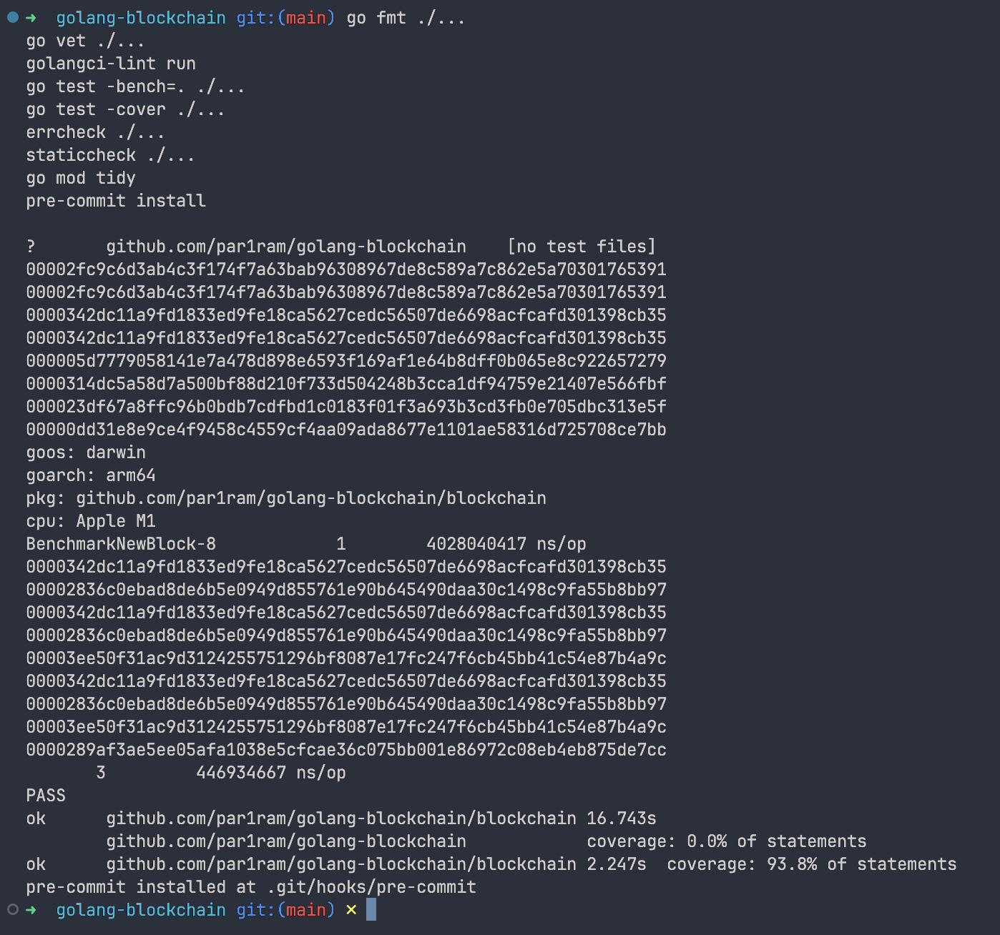
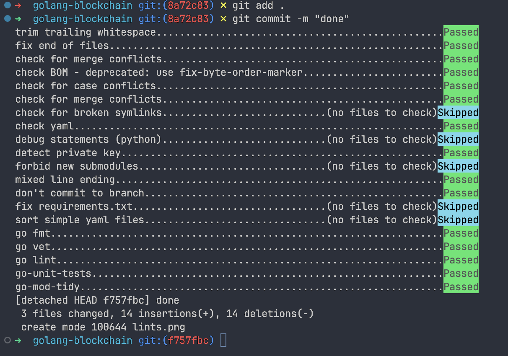

- go fmt ./...
- go vet ./...
- golangci-lint run
- go test -bench=. ./...
- go test -cover ./...
- errcheck ./...
- staticcheck ./...
- go mod tidy
- pre-commit install

### Линтинг

### Пре-коммит

